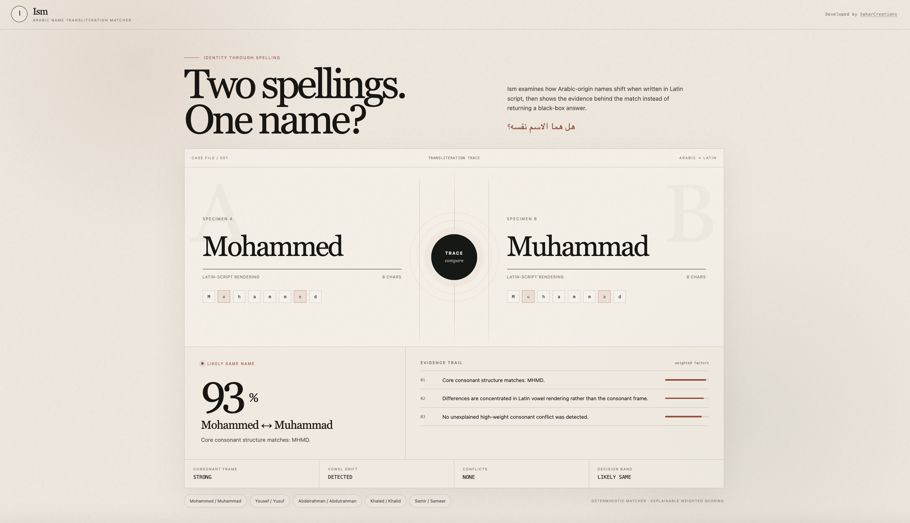

# Ism — Arabic Name Transliteration Matcher

**Does this spelling match that spelling?**

Ism is an explainable, deterministic matcher for comparing two Latin-script spellings of an Arabic-origin personal name.

`Mohammed ↔ Muhammad` should not be a black-box AI decision. Ism exposes the normalization, consonant structure, weighted evidence, conflicts, and final confidence band used to reach its result.

> Built with Java 17, Spring Boot, HTML, CSS and vanilla JavaScript. No LLM is used to make the match decision.

## Why this project

Arabic names frequently appear in multiple Latin spellings because romanization standards, vowel representation, consonant doubling, definite-article spelling, dialect, and individual preference do not always line up. Ism treats this as a string-processing and explainability problem rather than a CRUD problem.

The project is intentionally small: the engineering focus is the matching engine, false-positive control, API design, tests, and a polished 30-second demo.


## Demo flow

1. Enter two spellings.
2. Select **Trace**.
3. The frontend POSTs both names to `/api/match`.
4. The deterministic matcher normalizes and compares them.
5. Ism returns a confidence score, decision band, consonant frames, reasons, and detected differences.
6. The UI reveals the evidence trail instead of displaying only a percentage.

## Example API response

```json
{
  "match": true,
  "score": 0.93,
  "band": "LIKELY_SAME",
  "normalizedA": "mohammed",
  "normalizedB": "muhammad",
  "consonantFrameA": "MHMD",
  "consonantFrameB": "MHMD",
  "reasons": [
    "Core consonant structure matches: MHMD.",
    "Differences are concentrated in Latin vowel rendering rather than the consonant frame.",
    "No unexplained high-weight consonant conflict was detected."
  ],
  "differences": [
    {
      "type": "VOWEL_VARIATION",
      "a": "oe",
      "b": "uaa",
      "detail": "Arabic short vowels are not represented uniformly across Latin spellings."
    }
  ]
}
```

## Matching pipeline

Ism deliberately separates **formal romanization structure** from **real-world name variation**.

### 1. Safe normalization

- lowercase and trim input
- Unicode NFKD normalization
- remove Latin transliteration diacritics for comparison while keeping the submitted spelling visible in the UI
- normalize punctuation, apostrophes, spaces and hyphens
- protect Arabic transliteration digraphs such as `kh`, `gh`, `sh`, `th`, and `dh`

### 2. Structural comparison

Ism extracts a simplified consonant frame and compares it separately from the whole Latin spelling. For example:

```text
Mohammed  → MHMD
Muhammad  → MHMD
```

This lets vowel variation contribute less weight without making vowels irrelevant.

### 3. Controlled variation rules

The MVP recognizes a conservative set of explainable patterns:

- vowel-rendering differences when the consonant frame is preserved
- repeated-consonant / gemination spelling differences
- initial `al- / el-` article variation
- common concatenated `Abd + al` forms such as `Abdul- / Abdel-`
- conservative final `-a / -ah` variation
- `q/g` and `j/g` only as **regional candidates**, never automatic equivalence

The matcher does **not** globally declare `q = g`, `j = g`, `th = t`, or similar substitutions. Those can be dialect-sensitive and would create aggressive false positives.

### 4. Weighted score

The current score combines:

- consonant-frame similarity — **50%**
- whole-spelling edit similarity — **28%**
- length similarity — **10%**
- vowel compatibility — **12%**

High-weight unexplained consonant conflicts reduce the score.

A second guardrail prevents two different names with the same consonantal frame from becoming a high-confidence match when their complete spellings diverge too much. This matters for pairs such as `Ahmed / Hamid`.

### Decision bands

```text
0.82 – 1.00  LIKELY_SAME
0.68 – 0.81  POSSIBLE
0.00 – 0.67  UNLIKELY
```

These thresholds are MVP engineering choices, not linguistic claims. They are intentionally visible and testable.

## Test dataset

Positive regression examples include:

```text
Mohammed / Muhammad
Mohamed / Mohammad
Yousef / Yusuf
Khaled / Khalid
Sameer / Samir
Abdelrahman / Abdulrahman
Ahmed / Ahmad
Fatima / Fatimah
```

Negative regression examples include:

```text
Ali / Omar
Hassan / Hamza
Karim / Khalid
Salim / Samir
Nadia / Nabil
Mariam / Mahmoud
Yusuf / Younes
Ahmed / Hamid
```

The negative set is important: matching only by consonant skeleton is too permissive for Arabic-origin names.

## REST API

### `POST /api/match`

Request:

```json
{
  "nameA": "Mohammed",
  "nameB": "Muhammad"
}
```

Response: `MatchResult` JSON containing the verdict, score, normalized forms, consonant frames, reasons, and differences.

## Run locally

Requirements:

- Java 17+
- Maven 3.9+

```bash
mvn spring-boot:run
```

Then open:

```text
http://localhost:8080
```

Run tests:

```bash
mvn test
```

## Project structure

```text
src/main/java/com/ism/
├── IsmApplication.java
├── controller/
│   └── MatchController.java
├── model/
│   ├── Difference.java
│   ├── MatchRequest.java
│   └── MatchResult.java
└── service/
    └── TransliterationMatcher.java

src/main/resources/
├── application.properties
└── static/
    ├── index.html
    ├── style.css
    └── app.js

src/test/java/com/ism/service/
└── TransliterationMatcherTest.java
```

## Sources and linguistic grounding

Ism does not claim that one formal romanization standard describes every spelling people use for their names. The implementation uses formal standards to understand Arabic-to-Latin structure, while treating everyday spelling variation as a separate matching layer.

- Library of Congress, **ALA-LC Romanization Table — Arabic**  
  https://www.loc.gov/catdir/cpso/romanization/arabic.pdf

- United Nations Group of Experts on Geographical Names, **Arabic romanization system / Working Group on Romanization Systems**  
  https://unstats.un.org/unsd/ungegn/working_groups/wg5/documents/wgrr5arabic.pdf

- Ahmad B. A. Hassanat & Ghada Awad Altarawneh, **Rule-and Dictionary-based Solution for Variations in Written Arabic Names in Social Networks, Big Data, Accounting Systems and Large Databases**  
  https://arxiv.org/abs/1502.05441

- Ahmed H. Yousef, **Cross-Language Personal Name Mapping**  
  https://arxiv.org/abs/1405.6293

The large-name-dataset research is especially useful as a warning against overconfidence: rule-based alternatives still produce false acceptances and false rejections, so Ism exposes limitations rather than presenting its score as identity proof.

## Limitations

- The MVP compares **Latin-script spellings of Arabic-origin names**; it does not yet accept Arabic-script input.
- It is a similarity tool, not proof that two records belong to the same person.
- Dialect-sensitive consonant changes are deliberately conservative.
- The scoring weights and thresholds need a larger labeled dataset before production use.
- Some names that share an Arabic root or consonant frame are distinct names; whole-spelling similarity and conflict penalties exist specifically to reduce this failure mode.
- Name-owner preference always outranks a generated transliteration. Ism describes spelling similarity, not a person's "correct" name.

## Next experiments

- one name → ranked common transliteration variants
- Arabic-script input with explicit Arabic-letter evidence
- a larger labeled benchmark with precision/recall reporting
- optional locale hints that activate regional rules without making them global

## License

MIT
